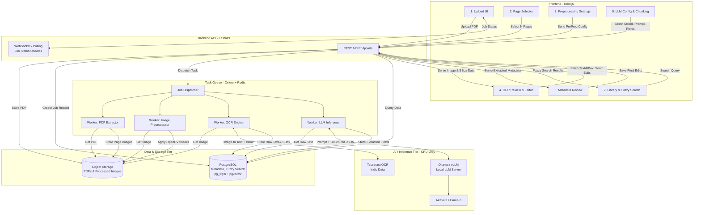

# Indic Book Metadata Extractor
### A Web Platform for OCR-Powered Metadata Extraction from Indic Language Books

---

## Overview

**Indic Book Metadata Extractor** is a public-facing, production-grade web application that enables users to upload scanned PDFs of books in Indic languages (Hindi, Tamil, Telugu, and others), perform OCR using Tesseract, and extract rich structured bibliographic metadata using a locally-hosted LLM — all through a sophisticated, guided multi-step workflow.

The platform is built around a background task queue architecture so that multiple users can submit PDFs concurrently without blocking the interface, and every stage of the pipeline — from page selection to OCR correction to LLM inference — is surfaced as an interactive, editable UI step.

---

## Goals

- Enable non-technical users to extract structured metadata from scanned Indic language books via a clean, step-by-step web interface.
- Support up to **52 bibliographic fields** per book, with user-editable prompts and batched LLM inference for high accuracy.
- Provide side-by-side OCR review with bounding box visualization and inline text correction.
- Persist all extracted data (raw text, images, metadata) in a searchable database with fuzzy search.
- Run entirely on **CPU-only cloud infrastructure** with no GPU dependency.

---

## Architecture

```
┌─────────────────────────────────────────────────────────┐
│                    Next.js Frontend                     │
│        (Upload → Page Select → Image Tune →             │
│         OCR Review → LLM Config → Metadata Review)      │
└────────────────────────┬────────────────────────────────┘
                         │ REST / WebSocket
┌────────────────────────▼────────────────────────────────┐
│                   FastAPI Backend                       │
│     (File handling, Job management, OCR, LLM proxy)     │
└──────┬────────────────────────────────────┬─────────────┘
       │                                    │
┌──────▼──────┐                   ┌─────────▼────────────┐
│ Celery +    │                   │  Ollama (local LLM)  │
│ Redis Queue │                   │  e.g. Airavata,      │
│             │                   │  Gemma-2-9B,         │
└──────┬──────┘                   │  Llama-3-8B          │
       │                          └──────────────────────┘
┌──────▼──────────────────────────────────────────────────┐
│             PostgreSQL + pgvector                       │
│    (Books, Pages, OCR Text, Metadata, Job Statuses)     │
└─────────────────────────────────────────────────────────┘
```

---

## High-Level Architecture Diagram



---

## Tech Stack

| Layer | Technology |
|---|---|
| **Frontend** | Next.js, Tailwind CSS, shadcn/ui |
| **Backend** | Python, FastAPI |
| **Task Queue** | Celery + Redis |
| **PDF Processing** | PyMuPDF (fitz) |
| **Image Pre-processing** | OpenCV, Pillow |
| **OCR Engine** | Tesseract (with Indic language packs) |
| **LLM Inference Server** | Ollama |
| **LLM Output Formatting** | Instructor + Pydantic |
| **Database** | PostgreSQL + pgvector |
| **Fuzzy Search** | pg_trgm / Fuse.js |

---

## User Workflow

### Step 1 — PDF Upload
- Drag-and-drop upload interface (supports multiple PDFs).
- Immediate validation: file type, size, language hint.
- Each uploaded PDF is assigned a unique Job ID and queued for processing.

---

### Step 2 — Page Selection
- User sets `n` pages from the **front** and `n` pages from the **back** to use for metadata extraction.
- Visual page grid showing thumbnail previews of all selected pages.
- Pages outside the selection are excluded from all downstream processing.

---

### Step 3 — Image Pre-processing Tuning
- Per-page image editing interface with live preview.
- Adjustable settings per page:
  - Grayscale conversion
  - Brightness & contrast sliders
  - Binarization (Otsu / adaptive threshold)
  - Deskew / rotation correction
- A "Apply to all pages" option for bulk settings.
- Once settings are confirmed, the job is registered in the background queue.

---

### Step 4 — Job Queue Dashboard
- Live list of all submitted jobs with status: `Queued` → `OCR Running` → `Awaiting Review` → `LLM Running` → `Complete`.
- Per-job progress indicator showing current page being processed.
- Users can leave and return — jobs persist and notify on completion.
- Cancel or retry individual jobs.

---

### Step 5 — OCR Review
- Side-by-side view: original page image (left) ↔ extracted raw text (right).
- Bounding box overlay on the page image for each detected text region.
- Click a bounding box to highlight the corresponding text in the editor.
- Inline text editor to manually correct OCR errors.
- Language indicator per page (auto-detected; overridable for bilingual pages).
- Navigate through all selected pages with Previous / Next controls.
- Save corrections before proceeding.

---

### Step 6 — LLM Configuration & Metadata Extraction
- Choose from available locally-hosted LLMs (configured via Ollama).
- Adjustable inference parameters: temperature, max tokens, top-p.
- View and edit the system prompt and extraction prompt template.
- **Batch field extraction**: choose how many of the 52 fields to extract per prompt (e.g. 10 fields per call) to maximize accuracy.
- All 52 default metadata fields are pre-configured (see list below); users may add custom fields but cannot remove default ones.
- Submit for background LLM processing — progress visible in the Job Queue.

#### Default Metadata Fields (52)

| # | Field | Wikidata Property |
|---|---|---|
| 1 | Label (Work and Edition) | — |
| 2 | Author | P50 |
| 3 | Description for Work | — |
| 4 | Description for Edition | — |
| 5 | Translator | P655 |
| 6 | Editor | P98 |
| 7 | Compiler (సంకలనకర్త) | — |
| 8 | Inception / First Written | P571 |
| 9 | Form of Creative Work | P7937 |
| 10 | Genre | P136 |
| 11 | Subject | P921 |
| 12 | Original Language | P364 |
| 13 | Edition or Translation of | P629 |
| 14 | Based on | P144 |
| 15 | Inspired by | P941 |
| 16 | Volume | P478 |
| 17 | Edition Number | P393 |
| 18 | Publication Date | P577 |
| 19 | Publisher | P123 |
| 20 | Place of Publication | P291 |
| 21 | Printer | P872 |
| 22 | Place of Printing | P2919 |
| 23 | Language | P407 |
| 24 | Cover Artist | P736 |
| 25 | Cover Page Designer | — |
| 26 | Type Setting by | — |
| 27 | Typing (టైపింగ్) | — |
| 28 | Book Designer | — |
| 29 | Distributors (పంపిణీదారులు) | — |
| 30 | Pages | P1104 |
| 31 | Dedication (అంకితం) | — |
| 32 | Dedication Verbatim | — |
| 33 | Part of Series | — |
| 34 | Serial Number within Series | — |
| 35 | Part of the Set | — |
| 36 | Illustrators (పుస్తకంలో బొమ్మలు వేసిన చిత్రకారులు) | — |
| 37 | ISBN | — |
| 38 | Title (if subtitle exists) | — |
| 39 | Subtitle | — |
| 40 | Awards (అవార్డులు) | — |
| 41 | Context (సందర్భం) | — |
| 42 | Publisher Telugu (ప్రచురణకర్త) | — |
| 43 | Sponsor | P859 |
| 44 | First Published In (తొలిగా ప్రచురించిన పత్రిక) | — |
| 45 | Forewords (ముందుమాట(లు)) | — |
| 46 | Abbreviations (సంక్షిప్తీకరణ) | — |
| 47 | Authors in Compilation (సంకలనంలోని రచయితలు) | — |
| 48 | Opinions / Messages (అభిప్రాయాలు / సందేశాలు) | — |
| 49 | Scribes (లేఖకులు) | — |

> Users may add additional custom fields at this stage. Default fields cannot be removed.

---

### Step 7 — Metadata Review & Editing
- Top section: page image viewer with bounding boxes, Previous / Next navigation, and click-to-copy text from any bounding box.
- Bottom section: all 52+ metadata fields displayed in a structured form.
  - Extracted values are pre-filled.
  - Missing or low-confidence fields are highlighted.
  - All fields are inline-editable.
- Save and finalize the metadata record to the database.

---

### Step 8 — Book Library & Search
- Dedicated library page listing all books with finalized metadata.
- Card-based layout showing cover page thumbnail, title, author, language, and date.
- **Fuzzy search** across all text fields and extracted metadata using trigram similarity.
- Filters by language, genre, publication year, publisher.
- Click a book to view its complete metadata record and return to editing if needed.

---

## Data Persistence

All of the following are stored in PostgreSQL:

| Entity | Details |
|---|---|
| `books` | Unique book record per uploaded PDF |
| `pages` | Per-page image path, pre-processing settings, page number |
| `ocr_results` | Raw OCR text per page, bounding box JSON, user corrections |
| `jobs` | Job ID, status, timestamps, error logs |
| `metadata` | All 52+ fields as structured JSON + individual indexed columns |
| `llm_runs` | Prompt used, model chosen, raw LLM response, field batch config |

Vector embeddings of book descriptions (via pgvector) are stored for future semantic search capability.

---

## OCR & Language Support

Tesseract language packs to be installed for:

- Hindi (`hin`)
- Tamil (`tam`)
- Telugu (`tel`)
- Kannada (`kan`)
- Malayalam (`mal`)
- Marathi (`mar`)
- Bengali (`ben`)
- Gujarati (`guj`)
- Punjabi (`pan`)
- Odia (`ori`)
- English (`eng`) — for bilingual pages

Bilingual PDFs are handled by enabling multi-language OCR mode in Tesseract (e.g. `lang=hin+eng`).

---

## LLM Models (via Ollama)

Recommended models for Indic language metadata extraction, selectable per job:

| Model | Best for |
|---|---|
| **Airavata (AI4Bharat)** | All Indic languages — purpose-built |
| **Gemma-2-9B-Instruct** | Hindi, general purpose |
| **Llama-3-8B-Instruct** | Hindi, multilingual |
| **Kan-Llama** | Low-RAM environments |

---

## Key Non-Functional Requirements

- **No GPU required** — all inference runs on CPU via Ollama.
- **Concurrent processing** — Celery + Redis task queue handles multiple simultaneous uploads.
- **Resumable workflow** — users can leave and return to any step without data loss.
- **Structured LLM output** — Instructor + Pydantic enforces strict JSON schema on every LLM response.
- **Local development** — containerised via Docker Compose for local development with uv for Python environment management.

---

## Out of Scope (v1)

- GPU-accelerated inference
- Real-time collaborative editing
- Automatic Wikidata submission
- Mobile native apps
